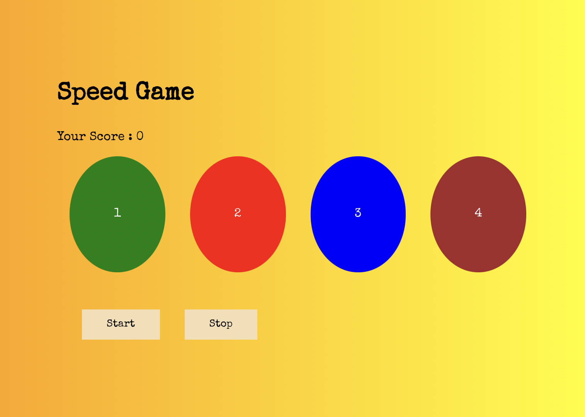
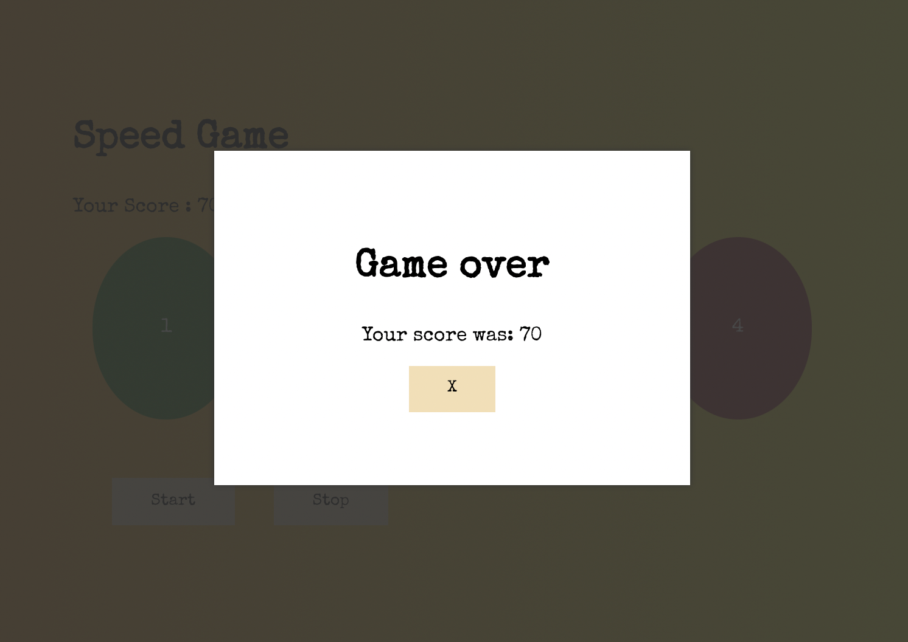

# Speed game App

- This react app is creating a speed game application
- we have 4 circles with different colors. Two buttons as well start and stop.
- When start button is clicked, randomly the app will highlight circles one after the other with background image of a smiley. You need to choose the right circle highlighted, by clicking on the button. For each correct selection you can score 10 marks.
- If your choice is incorrect or you have not selected or clicked any circle for five times consecutively the game will be over.

## screenshot

- 
- 
- 
